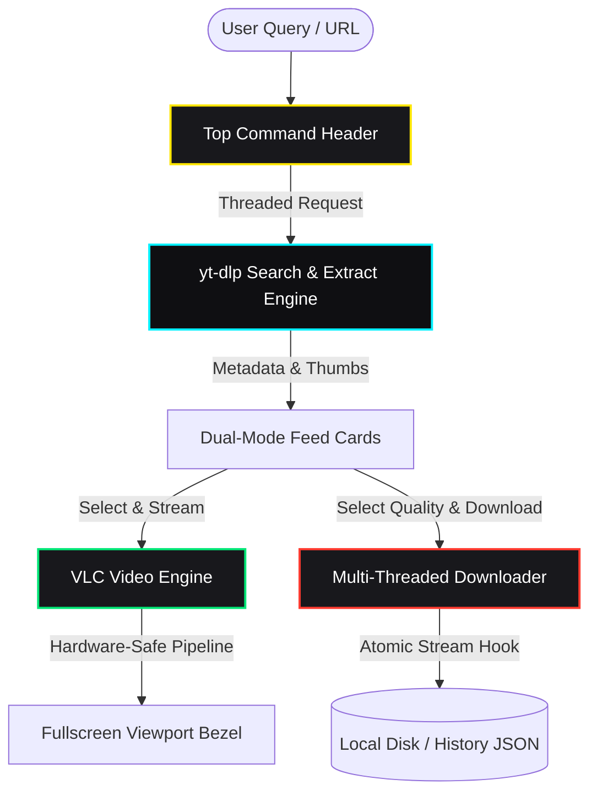

<div align="center">
  

  # YT // RAW LOADER
  
  **A high-performance, Neo-Brutalist YouTube video downloader & streaming media station powered by Python, VLC, and yt-dlp.**

  [](https://www.python.org/)
  [](https://github.com/ali38958/Youtube-Video-Downloader)
  [](LICENSE.md)
  [](https://www.videolan.org/)
  [](DESIGN.md)
  [](https://github.com/ali38958/Youtube-Video-Downloader/pulls)

  [✨ Features](#-why-is-yt--raw-loader-unique) • [🏗️ Architecture](#-system-architecture) • [🎨 Themes](#-neo-brutalist-theme-engine) • [⚡ Quick Start](#-getting-started) • [⌨️ Shortcuts](#-keyboard-shortcuts) • [🤝 Contributing](#-contributing) • [📄 License](#-license)

</div>

---

## 📖 The Problem It Solves

Most YouTube downloading tools are either bloated ad-ridden web scrapers, sluggish browser extensions, or barebones command-line scripts without instant preview playback. When searching for videos, managing download queues, or inspecting multi-resolution streams, switching between web browsers, video players, and terminal downloaders fractures your workflow.

**YT // RAW LOADER** unifies lightning-fast searching, live progressive streaming, high-definition downloading, and queue management into a single, high-contrast **Neo-Brutalist desktop console**.

---

## ✨ Why is YT // RAW LOADER Unique?

- 🎨 **Neo-Brutalist Aesthetic & Live Theme Switcher**: 4 striking high-contrast themes (**Cyber Dark**, **Raw Light**, **Acid Matrix**, **Retro Punk**) that switch instantly with zero restart.
- ⚡ **Embedded VLC Media Station**: Stream and preview any video or audio stream directly in-app before saving to disk.
- 🎯 **Pixel-Perfect Click-Seek & Scrubbing**: Custom coordinate-based position tracking gives millisecond-accurate timeline jumps without 2–3s offset drift.
- 📡 **Animated Radar & Telemetry**: Dynamic ASCII/Brutalist scanning radars, rotating stream extraction indicators, and live download speed meters (`[ 12.4 MB/s // 75% ]`).
- ⏸️ **True Thread-Level Pause & Resume**: Pause and resume downloads mid-stream without losing transferred bytes.
- 🛡️ **Anti-Bot & DPAPI Bypass**: Powered by `yt-dlp` multi-client extractors (`player_client: all`) to automatically circumvent YouTube throttling and bot verification challenges.
- 🖥️ **Seamless Fullscreen & Dual Feeds**: True 100% viewport expansion on double-click or `F` key, paired with dual-mode segmented tab navigation.

---

## 🏗️ System Architecture

Our engine utilizes an asynchronous, non-blocking pipeline separating search extraction, stream decoding, and concurrent download workers.



---

## 🎨 Neo-Brutalist Theme Engine

Switch colorways on the fly via the top-right header selector:

| Theme | Palette | Vibe |
|---|---|---|
| ⚡ **Cyber Dark** *(Default)* | `#0D0D11` Base • `#FFE600` Cyber Yellow • `#00F0FF` Cyan | Dark tactical cyberpunk console |
| 🏛️ **Raw Light** | `#F4F0EA` Paper • `#000000` Bold Inks • `#FF3300` Intl Orange | Industrial Swiss neo-brutalism |
| 🧪 **Acid Matrix** | `#050805` Carbon • `#00FF66` Acid Neon Green • `#00F0FF` Teal | Monochromatic hacker terminal |
| 🔮 **Retro Punk** | `#130E1C` Night Violet • `#FFB800` Gold • `#E056FD` Neon Pink | Synthwave retropop console |

---

## ⚡ Getting Started

### 📋 Prerequisites

1. **Python 3.10+**: Download from [python.org](https://www.python.org/).
2. **VLC Media Player (64-bit)**: Download the 64-bit installer from [videolan.org](https://www.videolan.org/).

### 📦 Installation

```bash
# 1. Clone the repository
git clone https://github.com/ali38958/Youtube-Video-Downloader.git
cd Youtube-Video-Downloader

# 2. Install dependencies
pip install -r requirements.txt

# 3. Launch the application
python main.py
```

---

## ⌨️ Keyboard Shortcuts

| Shortcut | Action |
|---|---|
| **`Space`** | Play / Pause media playback |
| **`F`** or **`Double-Click Video`** | Toggle True 100% Fullscreen |
| **`Escape`** | Exit Fullscreen |
| **`Left Arrow` / `Right Arrow`** | Seek backward / forward 5 seconds |
| **`J` / `L`** | Seek backward / forward 10 seconds |
| **`Enter`** *(in search bar)* | Trigger Search / URL Load |

---

## 🤝 Contributing

Contributions are warmly welcomed! Feel free to:
1. Fork the repository
2. Create your feature branch (`git checkout -b feature/amazing-feature`)
3. Commit your changes (`git commit -m "feat: add amazing feature"`)
4. Push to the branch (`git push origin feature/amazing-feature`)
5. Open a Pull Request

---

## 📄 License

This project is licensed under the **MIT License** — see the [LICENSE.md](LICENSE.md) file for details.

<div align="center">
  <sub>Built with ⚡ and high-contrast passion by <a href="https://github.com/ali38958">ali38958</a>.</sub>
</div>
